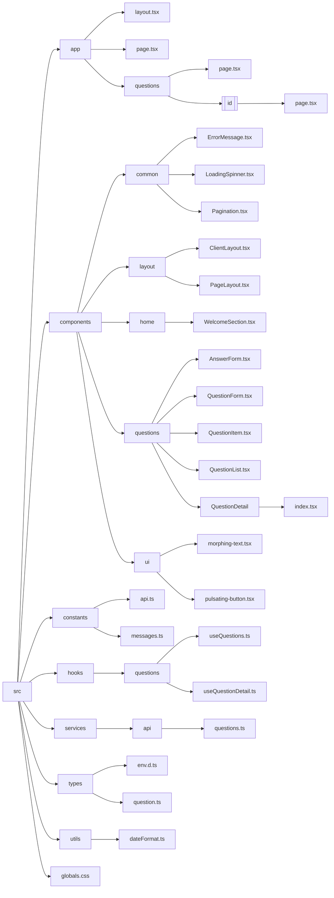

# EZEN Computer A조 Mini Project - Q&A 게시판

## 프로젝트 소개

이 프로젝트는 EZEN A조의 미니 프로젝트로, Next.js를 사용하여 개발된 Q&A 게시판 프론트엔드입니다.

## 기술 스택

- **Frontend**
  - Next.js 15.1.3
  - React 18.2.0
  - TypeScript
  - Tailwind CSS
  - Framer Motion
  - Axios
  - CICD

## API 엔드포인트

- GET /api/v1/questions - 질문 목록 조회
- GET /api/v1/questions/:id - 질문 상세 조회
- POST /api/v1/questions - 질문 등록
- POST /api/v1/answers - 답변 등록

## 주요 기능

- 질문 게시판 CRUD
- 답변 등록 및 조회
- 페이지네이션
- 반응형 디자인
- 애니메이션 효과
- 스피너

## 프로젝트 구조

```bash
src/
├── app/                           # Next.js 앱 라우터
│   ├── layout.tsx                 # 루트 레이아웃
│   ├── page.tsx                   # 홈페이지
│   └── questions/                 # 질문 관련 페이지
│       ├── page.tsx               # 질문 목록 페이지
│       └── [id]/                  # 동적 라우팅
│           └── page.tsx           # 질문 상세 페이지
│
├── components/                    # 컴포넌트
│   ├── common/                    # 공통 컴포넌트
│   │   ├── ErrorMessage.tsx      # 에러 메시지 컴포넌트
│   │   ├── LoadingSpinner.tsx    # 로딩 스피너 컴포넌트
│   │   └── Pagination.tsx        # 페이지네이션 컴포넌트
│   ├── layout/                    # 레이아웃 컴포넌트
│   │   ├── ClientLayout.tsx      # 클라이언트 레이아웃 컴포넌트
│   │   └── PageLayout.tsx        # 페이지 레이아웃 컴포넌트
│   ├── home/                      # 홈 관련 컴포넌트
│   │   └── WelcomeSection.tsx    # 환영 섹션 컴포넌트
│   ├── questions/                 # 질문 관련 컴포넌트
│   │   ├── AnswerForm.tsx        # 답변 폼 컴포넌트
│   │   ├── QuestionForm.tsx      # 질문 폼 컴포넌트
│   │   ├── QuestionItem.tsx      # 질문 아이템 컴포넌트
│   │   ├── QuestionList.tsx      # 질문 목록 컴포넌트
│   │   └── QuestionDetail/
│   │       └── index.tsx         # 질문 상세 컴포넌트
│   └── ui/                        # UI 컴포넌트
│       ├── morphing-text.tsx     # 변형 텍스트 컴포넌트
│       └── pulsating-button.tsx  # 펄스 버튼 컴포넌트
│
├── constants/                     # 상수 정의
│   ├── api.ts                    # API 관련 상수
│   └── messages.ts               # 메시지 상수
│
├── hooks/                        # 커스텀 훅
│   └── questions/                # 질문 관련 훅
│       ├── useQuestions.ts      # 질문 목록 훅
│       └── useQuestionDetail.ts # 질문 상세 훅
│
├── services/                     # API 서비스
│   └── api/
│       └── questions.ts         # 질문 API 서비스
│
├── types/                       # 타입 정의
│   ├── env.d.ts                # 환경변수 타입
│   └── question.ts             # 질문 관련 타입
│
└── utils/                      # 유틸리티
    └── dateFormat.ts          # 날짜 포맷 유틸리티


```



### 필수 조건

- Node.js 18.0.0 이상
- npm 9.0.0 이상

### 설치

1. 프로젝트 클론
2. 패키지 설치
3. 환경 변수 설정
4. 서버 실행

저장소 클론

git clone https://github.com/joshbae119/ezen-mini-frontend.git

## 배포

- GitHub Actions를 통한 자동 배포
- AWS EC2 인스턴스에 PM2로 운영

## 환경 변수

프로젝트 루트에 `.env` 파일을 생성하고 다음 변수를 설정하세요:
